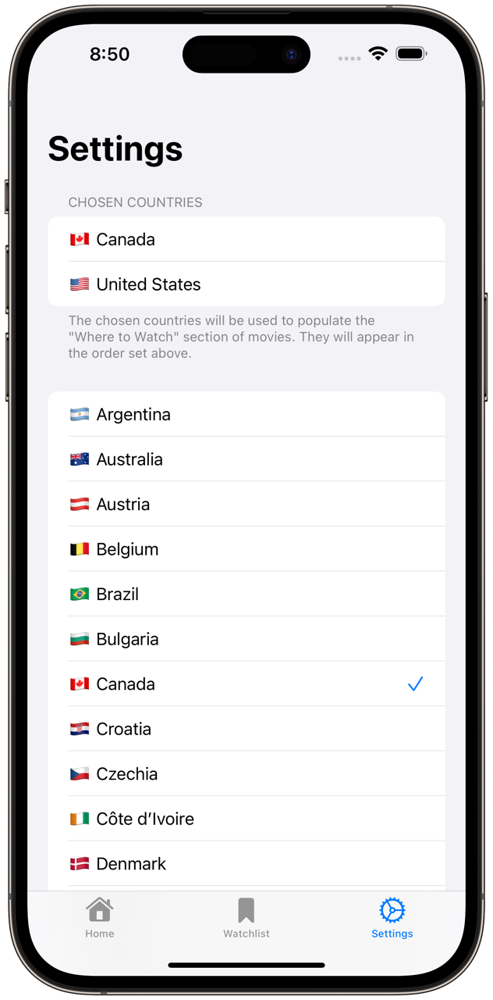

# MovieTime

MovieTime is an app that uses [The Movie Database API (TMDB)](https://developers.themoviedb.org/3) to allow users to keep track of the movies they want to watch (Watchlist) and where they can watch them (Streaming services). Also, MovieTime presents many lists of movies (Trending, Now Playing and Upcoming) to help the user build up their list of movies to watch.

## Technologies
- SwiftUI
- MVVM Architecture
- Networking
	- `URLSession` with Swift Concurrency
	- `Codable` with `JSONDecoder`
- Combine
	- Used in the HomeView to query the API while the user is searching for a movie. I used `.debouce()` to wait 0.5 seconds before performing a request. This avoids unnecessary network calls.
- Core Data
	- Used to persist the Watchlist of movies
	- Used `NSPredicate` and `NSSortDescriptor` to filter and sort the results
- UserDefaults (for Settings storage)
	- Used to persists the countries to show in the "Where to Watch" section of the `MovieDetailsView` screen
	- `JSONEncoder` and `JSONDecoder` were used to store the settings as `Data` objects
- UIKit
	- Used the `UIViewControllerRepresentable` protocol to manage a `SFSafariViewController` and present the trailer videos without leaving the app

## Preview

## Screens
<table>
	<thead>
		<th>Description</th>
		<th>Screenshots</th>
	</thead>
	<tbody>
		<tr>
			<td>
				<h3>HomeView</h3>
				<code>HomeView</code> presents a search bar to find movies to add to the watchlist. While the search bar is empty, the <code>DiscoverView</code> is overlaid on top.  
				<h3>DiscoverView</h3>
				<code>DiscoverView</code> is a screen that presents multiple lists of movies to help the user to populate their Watchlist. At the moment, the lists of movies shown are: <em>Trending</em>, <em>Now Playing</em> and <em>Upcoming</em>.
			</td>
			<td>
				
                
			</td>
		</tr>
		<tr>
			<td>
				<h3>MovieDetailsView</h3>
				<code>MovieDetailsView</code> presents all the information related to a movie. It shows a cover and poster photos, overview of the movie, where to watch it, trailer and teaser videos as well as the cast (actors) that appear in it.
			</td>
			<td>
				
			</td>
		</tr>
		<tr>
			<td>
				<h3>WatchlistView</h3>
				<code>WatchlistView</code> presents a grid of movies that the user has added to their Watchlist. The movies are persisted using <code>Core Data</code>.
			</td>
			<td>
				
			</td>
		</tr>
		<tr>
			<td>
				<h3>SettingsView</h3>
				<code>SettingsView</code> shows a list of all the countries for which there is where to watch information (Streaming services and/or stores). The user can select which countries they want to see in the "Where to Watch" section of the <code>MovieDetailsView</code> screen. Their list of selected countries is persisted in <code>UserDefaults</code>.
			</td>
			<td>
				
			</td>
		</tr>
	</tbody>
</table>

## Features that I want to add
- [ ] Caching of images
- [ ] CloudKit to synchronize the Watchlist of movies
- [ ] Unit Testing

## What I learned / Gained more experience in
- Swift Concurrency
	- I learned how to perform API call using `async/await`
	- Learned about `Task` and `.task()` ViewModifier to perform asynchronous tasks.
	- Learned about actors, more specifically `@MainActor` to perform UI changes on the main thread.
- Combine
	- I learned about `.sink()` and `.debouse()` to perform API calls effectively instead of performing a fetch request after every change of the search query.
- Core Data
	- I learned how to use `Core Data` to persist the list of movies in the watchlist.
- How to structure API URLs (Endpoints)
	- I learned to create an `Endpoint` struct to build the API URLs using `URLComponents` instead of having many URLs scattered throughout the project.
- SwiftUI
	- I learned about `PreferenceKey` to send data from a child view to a parent view. I needed this because I created a collapsible view. I needed to get the minimum height and the maximum height of the child view to be able to change the height of the parent view between the two values.

## Difficulties
- Core data
	- Problem: I unticked the Optional option in the `.xcdatamodel` because the properties weren't optional. However, when saving the context I keep receiving errors: `"Multiple validation errors occurred."` mentioning that the values were required but were nil even though they weren't.
	- Solution: I had to make the properties optional again in the `.xcdatamodel` file.  
	However, to make sure that they could never be nil, I created an initializer that takes the context and the Movie object that was fetched from the API. In this custom initializer I populated all the properties that I wanted to persist. This solution prevented the possibility of having nil values as well as made the creation of `NSManaged` objects easy since I didn't have to populate the properties manually each time. ([See the code](https://github.com/andavazgar/MovieTime/blob/0d0bfb9950746bbc7ce05045164ff7005ad544e5/MovieTime/Core%20Data/WatchlistMovie.swift#L38-L52))
- SwiftUI: `WatchlistButtonView` action in `ListView`
	- Problem: When performing a search, the search results contained the `WatchlistButtonView` to add/remove a movie to/from the Watchlist. However, when it was tapped inside a `ListView` both the `WatchlistButtonView` action and the `NavigationLink` action were called.
	- Solution: After some research, I discovered that `.onTapGesture` behaved differently than a button action. As a result, I added the `isInList` property to `WatchlistButtonView` to perform the button action as an `.onTapGesture` istead of a button action. ([See the code](https://github.com/andavazgar/MovieTime/blob/0d0bfb9950746bbc7ce05045164ff7005ad544e5/MovieTime/Views/Components/WatchlistButtonView.swift#L28-L42))
